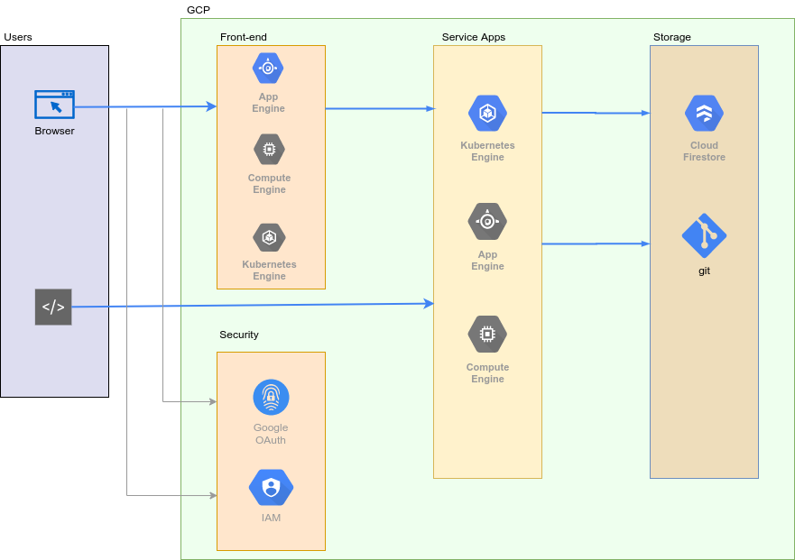
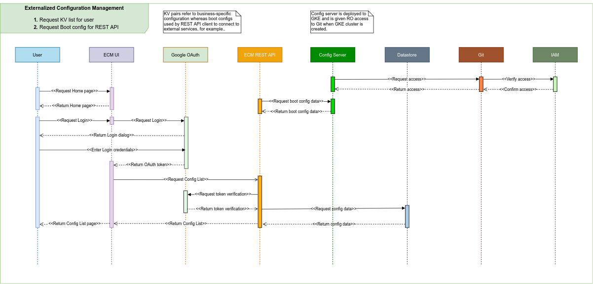
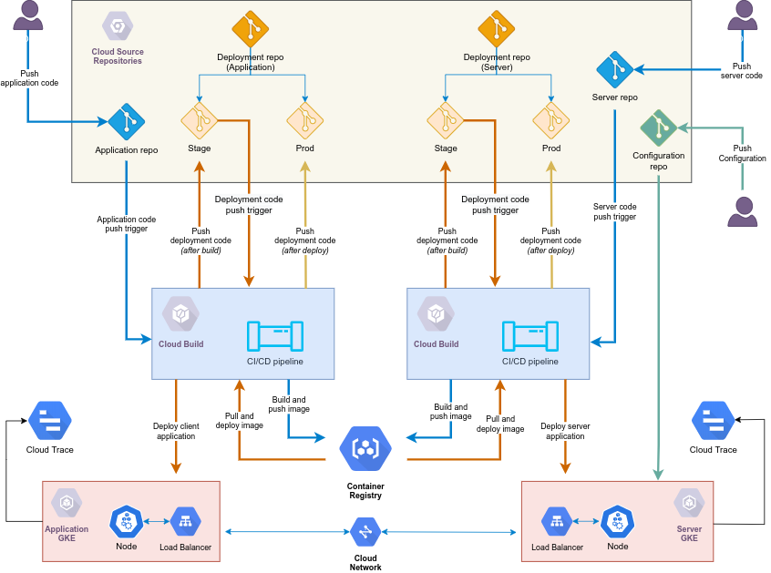

## Externalized Configuration Management

This is a Google Cloud-native solution. Its objective is to:

1. demonstrate the use of Spring Cloud Config modules to store and retrieve KV pairs from two data stores: Git and Firestore
2. show how to externalize application configurations broadly divided into user-managed configurations and application configurations required during startup/runtime
3. walk-through the deployments of:
	- Angular web UI to App Engine
	- Spring Boot applications to GKE using Cloud Build
4. incorporate containerization within a CI/CD pipeline
5. configure the applications to use service accounts to access external services

### Demo

TBA

### Technology Stack

- OpenJDK
- Spring Framework
	- Spring Boot
	- Spring Cloud Config Server
	- Spring Cloud Config Client
	- Spring Cloud Security
- Google Cloud
	- IAM & Admin
	- App Engine
	- Kubernetes Engine
	- Firestore
	- Source Repositories
	- Container Registry
	- Cloud Build
	- Logging
	- Trace
- Docker
- Google OAuth
- Angular
- Lombok
- JUnit
- Git

### Deployment Components

1. Configuration data
1. Angular UI
1. Spring Boot Client Application
1. Spring Boot Server Application
1. Client deployment configuration
1. Server deployment configuration

### High-Level Flow

The following diagram shows the data flow from consuming applications all the way to the data store. In between, there are multiple options at each stage. For instance, consuming applications could be a browser, a terminal, or an application making REST API calls after proper authentication and authorization. To highlight the actual implementation, the active components are marked in blue while other options are marked in gray.

In the current implementation,  the web UI front-end is an Angular application running on a Google Cloud App Engine. The application may also be deployed on a Compute Engine depending on specific requirements.

Another option for external configuration management is to use a Spring Config Server with a git repository as the data store. In that case, a Spring Config Client application would be autowired to retrieve the configuration during startup and serve as a REST API to provide that configuration to its consumers. This, however, is not shown in this high-level diagram but included in the architecture section instead.

### Flow Sequence

Two use-case scenarios are given in the flow diagram to explain the steps involved in processing user requests and system requests for configuration parameters from the data store:

1. Retrieve KV list for user
2. Request Boot config for REST API

User requests are initiated from a browser; whereas, system requests are made by the Spring Boot REST API application. In both cases, requests for configuration are properly authenticated and authorized before providing the response.

### System Architecture

Show in the architecture diagram are the following components:

- client application repository
	- stores the code for REST API application
- server application respository
	- stores the code for spring boot application that runs as the spring config server
- configuration repository
	- stores the configuration files for various environments: dev, qa, uat, prod, etc.
- pipeline to deploy the client application
- pipeline to deploy the server application
- container registry to store client and server application docker images
- GKE cluster to run the client application
- GKE cluster to run the server application
- Cloud Trace to monitor HTTP requests

When the user makes changes to either the client or server or both via git commit, it triggers an automatic deployment of that application to its respective GKE cluster. And it is all managed by the Cloud Build service. What makes this commit start the auto deployment are the triggers configured on Cloud Build.

To make changes to the KV pairs stored on the configuration repository, just commit the changes and the server will read the updated values when processing requests from the client application.

### Additional Enhancements

- It may be possible to replace the server component with a cloud function. But the client application would lose the autowiring capability to boot itself up during startup.
- Re-design the server component as a REST API service. This would add new capability to the server component to process requests from clients that do not have autowiring capability.
- Deploy both client and server on the same GKE cluster.

### Related links

1. [Angular front-end](frontend.md)

### References

1. Spring Cloud - https://cloud.spring.io/spring-cloud-static/spring-cloud.html
1. Spring Cloud Config - https://cloud.spring.io/spring-cloud-config/reference/html/
1. Spring Cloud Config Client - https://cloud.spring.io/spring-cloud-config/multi/multi__spring_cloud_config_client.html
1. Spring Cloud GCP Firestore - https://cloud.spring.io/spring-cloud-static/spring-cloud-gcp/1.2.0.M1/#_cloud_firestore
1. OAuth2 Resource Server - https://docs.spring.io/autorepo/docs/spring-security-oauth2-boot/2.0.0.RC2/reference/html/index.html
1. Google Auth with Spring Security resource server - https://arnoldgalovics.com/google-oauth-with-spring-security-as-separated-resource-server/
