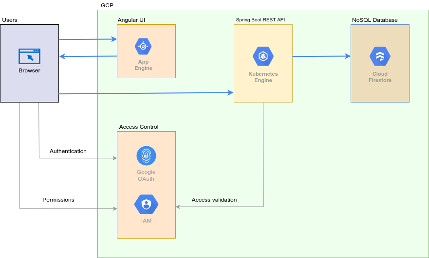
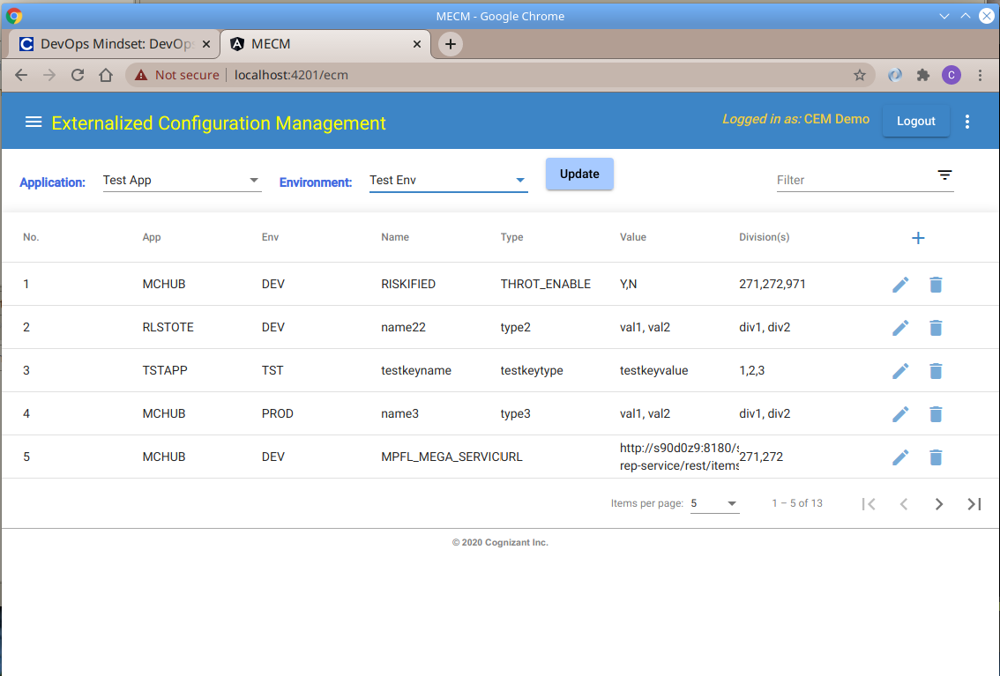
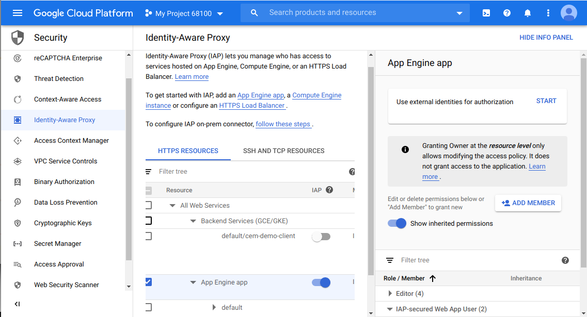
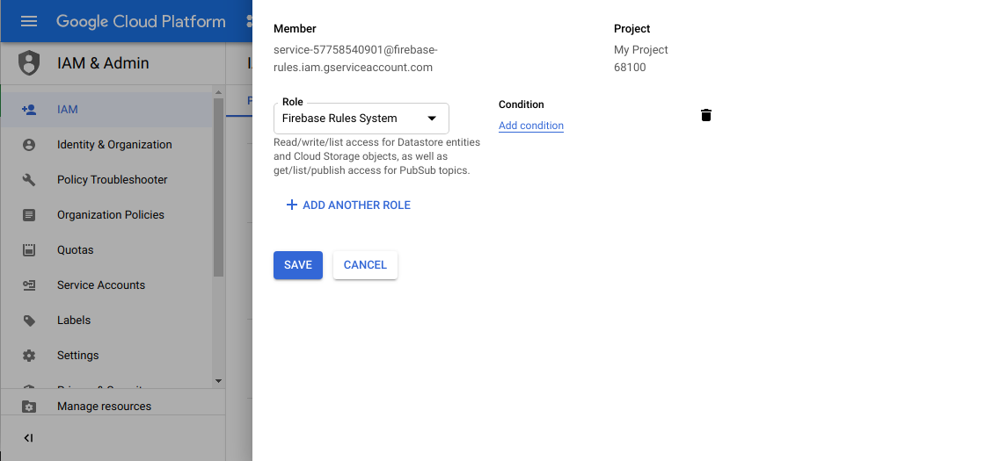
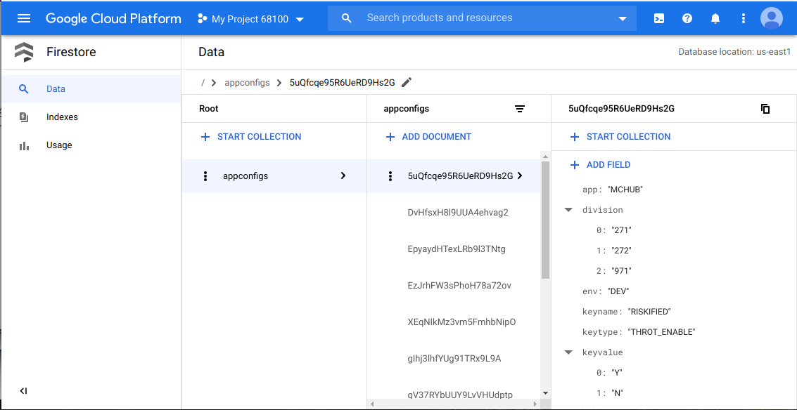

# ECM Application #

## Summary ##
Externailized Configuration Management (ECM) application is an Angular plus Spring Boot microservices implementation to retrieve configuration parameters in the form of key-value (KV) pairs from Google Cloud Firestore. Angular provides the front-end while Spring Boot provides the service endpoints using REST API interface. Firestore is a managed NoSQL cloud database from Google that is used as the data store by the ECM application.

Configuration parameters managed by the application can be broadly grouped into two categories:  
1. application boot/startup parameters and
2. runtime application parameters

It should be noted, however, that any KV pair can be managed by the application and it is up to the consumer applications on how to make use of those KV pairs.

## Implementation overview ##
Application parameters can be managed in multiple ways. In the simplest case, a user can login to GCP console and directly manage the data on Firestore. The user can also invoke the REST API requests provided by the Spring Boot application.

In our implementation, the parameters are managed from an Angular UI front-end as it provides a few important advantages over other methods:  
- first being the UI itself providing an easier way to work with the parameters
- the other advantage is the integration of single-sign-on with Google authentication and most importantly with IAM thus providing all the access control that comes along with it

After the user is authenticated, the front-end application communicates with Spring Boot REST API to retrieve the application parameters (in the form of key-value pairs) from Firestore. The Spring Boot application implementing REST API uses the client API provided by Firestore to manage the data.
  

  

*Fig: Application components interaction*  

## Angular UI ##

  

*Fig: Front-end to manage application parameters*  

Angular UI provides the front-end to manage application parameters. Its login functionality fulfills the dual-role of authenticating users via Google single-sign-on and providing authorization to them to access the application on GAE.

Authorization is managed by using the pre-defined *roles/iap.httpsResourceAccessor* role in IAM. It is accomplished by adding authorized users to this role and using it to configure the App Engine on IAP (Identity-Aware Proxy) console page.

  

*Fig: App Engine configuration with IAP*  

The front-end application is thus able to make use of the access control provided by IAM. After proper authentication and authorization, a user can perform any CRUD operation on the parameters: read, create, update, or delete.

There are two important parameters not managed by the users: **application** and **environment**. These are provisioned by business/operations team whenever an application needs to on-boarded. By associating an application and environment with each parameter, namespaces can be created for each application and for each environment.

## Spring Boot REST API ##
The REST API is a spring boot application and it uses a service account to gain access to Firestore. Access to REST API, in turn, by consumer applications including the UI is controlled via OAuth2 access token mechanism. A consumer application needs to provide a valid OAuth2 access token along with each of its requests to access the REST API endpoints.

The spring boot application, upon validation of the access token with Google Cloud, processes the requests from validated consumers. It provides the following endpoints for managing the parameters:
- /config/list
- /config/save
- /config/delete

The endpoint **/config/save** is used for both add and update operations. To perform all these operations on Firestore database, on behalf of the consumers, the REST API is provided an IAM service account with proper permissions. Details of this account are exported as a json file and the REST API application uses it to access the database via Firestore API.

  

*Fig: IAM service account used by the REST API to access Firestore*  

## NoSQL Database ##

  

*Fig: Document collection on Cloud Firestore*  

Configuration parameters are stored in Firestore in the form of documents under a collection. Firestore is a serverless and schemaless NoSQL database and provides a flexible way of storing key-value pairs. This provides us the ability to store any arbitrary data and be able to retrieve them quickly and efficiently. It is made possible by the client API from Firestore that the REST API uses to retrieve the stored data.

## Related Links ##
- [Demo video on YouTube](https://youtu.be/6WZ72nSnfDU)

## References ##
- [Angular](https://angular.io/)
- [Angular Material](https://material.angular.io/)
- [Spring Boot](https://spring.io/projects/spring-boot)
- [Cloud Firestore](https://firebase.google.com/docs/firestore)
- [Identity and Access Management](https://cloud.google.com/iam)
- [Identity-Aware Proxy](https://cloud.google.com/iap)
- [Angular Social Login](https://www.npmjs.com/package/angularx-social-login)
